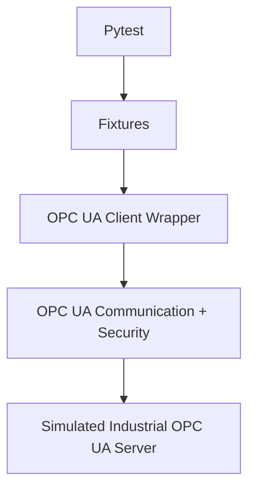

# OPC UA Client Testing & Automation Framework

## Overview

A Python, Pytest, and asyncua portfolio project for repeatable OPC UA client-server integration testing. It uses a local simulated industrial plant; it is not ABB hardware or a production ABB system.

## Objective and problem statement

Industrial communication needs repeatable verification of data access, control, subscriptions, failures, and security. Manual checks are slow and difficult to reproduce. This framework automates those checks against a deterministic local OPC UA server, producing logs, reports, coverage, and CI results.

## Architecture



Function-scoped fixtures start a clean server and connected client for every integration test. `OPCUATestClient` hides low-level asyncua operations; `OPCUATestServer` exposes the simulated plant.

## Technology stack and structure

- Python 3.11+, asyncua 2.x, Pytest, pytest-asyncio, pytest-html, pytest-cov, PyYAML, GitHub Actions.
- `src/opcua_framework/client`: client wrapper; `server`: plant and security; `config`: YAML settings/test data; `utils`: certificate tooling.
- `tests/functional`: connection, browse, read/write, method tests; `tests/subscription`: monitored items; `tests/security`: authentication, certificate trust, and secure modes.

## OPC UA test target

The local server endpoint is `opc.tcp://127.0.0.1:4840/abb-test-server/`. Its `IndustrialPlant` contains sensor variables (Temperature, Pressure, Vibration), motor variables (Speed, Current, Status), and `StartMotor`/`StopMotor` methods. It supports functional testing, subscriptions/monitored items, method calls, and negative tests against real OPC UA communication.

## Installation

```powershell
py -3.11 -m venv .venv
.\.venv\Scripts\Activate.ps1
python -m pip install --upgrade pip
pip install -e .
```

## Running server and tests

Tests automatically manage the server through fixtures. To run it manually:

```powershell
py -3.11 -m opcua_framework.server
```

Run tests and categories:

```powershell
pytest
pytest -m smoke
pytest -m functional
pytest -m subscription
pytest -m security
pytest -m negative
```

Generate artifacts:

```powershell
pytest --html=reports/report.html --self-contained-html
pytest --cov=src --cov-report=html:reports/coverage
```

## Authentication and security

Security tests use actual OPC UA SecureChannel configuration with the `Basic256Sha256` policy in `Sign` and `SignAndEncrypt` modes. `Sign` provides integrity and peer authentication; `SignAndEncrypt` also encrypts SecureChannel messages. This is OPC UA security, not TLS.

The secure server authenticates username/password clients and validates client X.509 application certificates against an explicit trust list. Tests verify valid credentials, rejected bad/unknown credentials, trusted certificates, rejected untrusted certificates, and mismatched expected server certificates. Development certificates are generated at runtime; no private keys or secrets are committed.

Generate development certificates for manual experiments only:

```powershell
py -3.11 -m opcua_framework.utils.generate_certificates
```

## Configuration, logs, reporting, and coverage

Non-secret defaults are in [config/framework.yaml](config/framework.yaml): endpoint, timeouts, publishing interval, sensor ranges, security-adjacent test settings, and reusable test data. Use `OPCUA_ENDPOINT` to override the normal endpoint. Credentials and private-key paths must never be committed.

Logs are written to `logs/test-run.log`. HTML reports show names, outcomes, duration, captured output, and failures. Coverage output is written to `reports/coverage/`. Logs and reports are ignored by Git.

## CI/CD

GitHub Actions runs on every push and pull request using Python 3.11. It installs the project with `pip install -e .`, runs the full suite, produces HTML and coverage reports, and fails on genuine test failures. Fixtures start the simulated server automatically; CI needs no persistent background server. Only logs/reports are uploaded—never keys or certificates.

## Troubleshooting and limitations

- If `py` cannot find Python, install Python 3.11+ and reopen PowerShell.
- If port 4840 is occupied, stop the existing process or set `OPCUA_ENDPOINT` to a free local endpoint.
- If packages are missing, activate the environment and run `pip install -e .` again.
- Security tests require loopback OPC TCP access but generate their own certificates.

This project deliberately does not implement production PKI/CA chains, revocation, TLS transport, or real ABB hardware integration. The simulated server is localhost-only and intended for automated QA learning.
